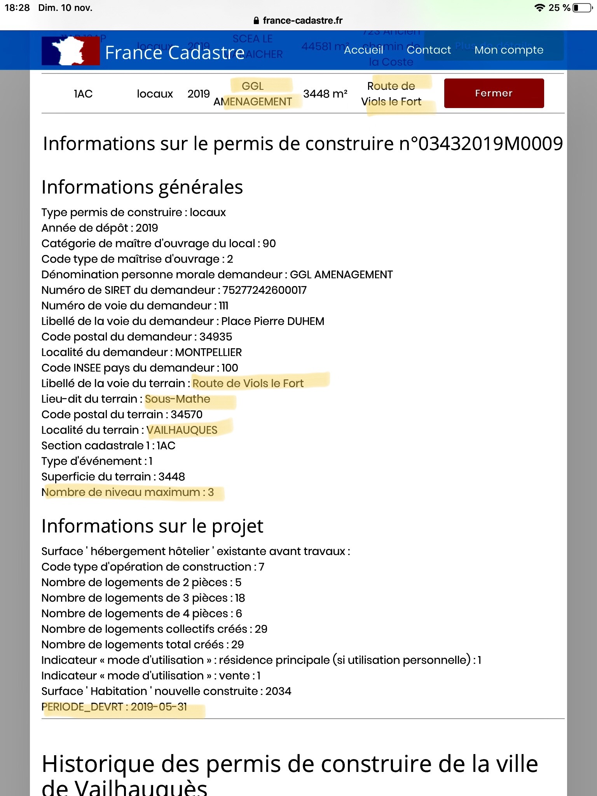

# Vailhauques watchdog

### C'est quoi un watchdog?


Definition du watchdog: 

```
Cette collocation fait référence à l'attitude de vigilance permanente et de recherche des faits réels. Elle s'inscrit dans une échelle de valeurs où la vérité est l'affaire de tous, et ne saurait être l'apanage d'un groupe, d'une faction, ou, pire encore, d'un seul homme.
```

[Cliquer ici pour plus d'informations](https://blogs.mediapart.fr/jean-louis-legalery/blog/201108/le-concept-de-watchdog)

### Projet de modification du PLU

La Mairie de Vailhauques a mis en disposition 20 documents avec plus de XXX pages en total à rédiger pour comprendre les modifications proposés par le nouveau PLU. Si vous voulez les consulter, ils se trouvent [ici](http://www.ville-vailhauques.fr).

Si vous n'avez pas le temps de lire les 20 documents, voici notre decryption.

Pour information, une petition a ete cree sur [change.org](https://www.change.org/p/monsieur-le-maire-de-vailhauquès-contre-la-modification-de-plu-n-1-à-vailhauquès?recruiter=643620389&utm_source=share_petition&utm_medium=copylink&utm_campaign=share_petition).

#### Augmentation du nombre des logements


```sh
Un premier point aborde par la proposition de modification du PLU concerne l'augmentation du nombre des logements. **Les documents proposent une augmentation de 500 logements** (Reference: http://www.ville-vailhauques.fr). 
```

<u>Decryptage:</u>

Nous savons qu'en moyenne, chaque logement sur Vailhauques a 2.7 habitants (Reference: http://www.ville-data.com). Donc nous pouvons facilement conclure que la modification du PLU propose **une augmentation de 1350 habitants.**


La population actuelle de Vailhauques est de 2710 habitants (Reference: http://www.ville-data.com). L'ajout de 1350 habitants elevera la population a 4074 habitants en 2030 (Figure 1). **Ceci represente une augmentation de 50% de la population par rapport a 2020.**

Par contre, si Vailhauques suivait le taux d'augmentation de la population moyenne de l'Herault (1.6%, Reference: http://www.ville-data.com), nous arriverons a 3167 habitants en 2030 (Figure 1).

Si nous calculons le taux d'augmentation de la population depuis l'annee 2000, le PLU modifie estime une augmentation total de plus de 120% par rapport a l'annee 2000, un taux similaire a celui de Montarnaud (140%), et nottament superieur a celui de l'Herault (50%). Ces resultats sont synthetises dans la Figure 1.


*Figure 1. Percentage d'augmentation de la population de Vailhauques depuis 1999. Reference: http://www.ville-data.com.*


```bash
Le document I-PADD.pdf dans http://www.ville-vailhauques.fr nous explique que le taux d'augmentation de la population sera de 1.8% par an. 
```

Si le taux d'augmentation etais de 1.8% par an, et en considerant que la population de Vailhauques a l'heure actuelle est de 2700 habitants, nous attendrons une augmentation de ~400 habitants dans 10 ans. 

Comme il y a ~2.7 habitants par foyer, une augmentation de 400 habitants representerait: $ 400 / 2.7 = 148 $  foyers. **Ceci est inconsistant avec les 500 foyers proposes par la modification du PLU.**

Si maintenant, nous croyons les 500 nouveaux foyers proposes par les textes de modification du PLU, nous pouvons estimer le *vrai taux d'augmentation de la population proposes dans ces textes*, qui est de **4.7%/an, similaire a celui de Montarnaud **(4.3%/an, voir Figure 2), **et loin du taux moyenne de la region** (1.6%/an).


*Figure 2. Percentage annuel d'augmentation de la population de Vailhauques  depuis 2010. Reference: http://www.ville-data.com* 

#### Densification

Le projet de modification du PLU propose une densification importante de la commune de Vailhauques.

Dans les projets futurs des construction dans Vailhauques, nous pouvons remarquer le projet porté par 'GGL Amenagement' pour construire 33 maisons, un parking, et 1 bâtiment collectif R+2 de 29 logements dans le quartier de l'Eglise. Le permis de construction a été déposé par GGL le 31 Mai 2019. Si vous voulez le voir, regardez la Figure 4 ci-dessous.


*Figure 3. Le quartier de l'Eglise ce dimache 17 Novembre 2019. Le projet de GGL avec 33 maisons, un parking, et un batiment de 3 etages avec 29 logements.*




*Figure 4. Permis de construction pour un R+2 depose par GGL dans le site: http://france-cadastre.fr*

