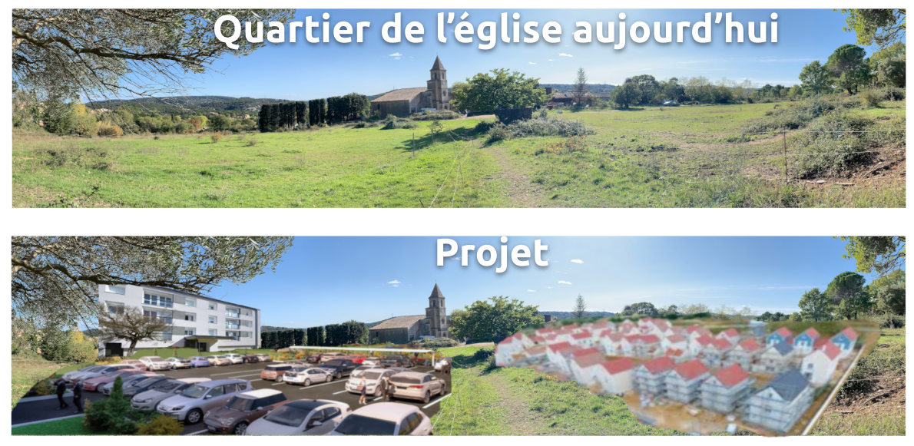

# Vailhauques watchdog

### C'est quoi un watchdog?


Definition du watchdog: 

```
Cette collocation fait référence à l'attitude de vigilance permanente et de recherche des faits réels. Elle s'inscrit dans une échelle de valeurs où la vérité est l'affaire de tous, et ne saurait être l'apanage d'un groupe, d'une faction, ou, pire encore, d'un seul homme.
```

[Cliquer ici pour plus d'informations](https://blogs.mediapart.fr/jean-louis-legalery/blog/201108/le-concept-de-watchdog)

### Projet de modification du PLU


*Vous avez pas eu le temps de lire les 20 documents PDF mis à disposition par la Mairie?* 


**ENQUÊTE PUBLIQUE DU 18 NOVEMBRE AU 18 DÉCEMBRE 2019**


#### Augmentation du nombre des logements

500 nouveaux logements [Ref. 1]  = 1350 nouveaux habitants [Ref. 2] = 50% d’augmentation de population 


#### Densification

Le projet de modification du PLU propose une densification importante de la commune de Vailhauques.

Dans les projets futurs des construction dans Vailhauques, nous pouvons remarquer le projet porté par GGL pour construire 33 maisons, un parking, et 1 bâtiment collectif R+2 de 29 logements dans le quartier de l'Eglise. Le permis de construction a été déposé par GGL le 31 Mai 2019. Si vous voulez le voir, [cliquer ici](https://france-cadastre.fr/permisdeconstruire/vailhauques).




La densification de la population est contraire au bien-être et dégrade le cadre de vie.


Préserver les espaces verts et le patrimoine dans un village en pleine croissance est un choix


#### References

[1] Reference: ville-vailhauques.fr: Modification de PLU no 1: I-PADD.pdf  

[2] 2.7 habitants par foyer. Reference: ville-data.com

[3] Projections selon ville-data.com, ville-vailhauques.fr, modification proposé du PLU no 1: I-PADD.PDF 